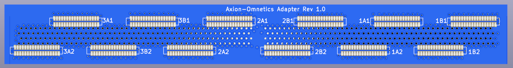

The adapter design utilizes the ground and reference planes as well as via stitching and minimized path length to reduce EMI. This 4-layer design with blind vias can be made cheaply, but I would recommend using a quality service as precise drill spacing is essential for the spring contacts. The omnetics connectors were chosen for broad compatibility with acquisition systems including Intan Tech, Open Ephys, Willow etc.

Hardware:
* 12x A79026 Omnetics 36-position port*
* 396x ED1122-ND contact spring pins

*This footprint will also fit other orientations of plugs and ports in Omnetics product line, but verify the datasheets first.

  

